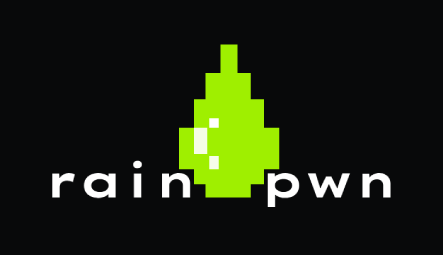

     

   

[Findings](#findings) &middot; [Published work](#published-work) &middot; [Contact](#contact)

---

Alessandro Sgreccia. I do vulnerability research on network security appliances: firewalls, access points and security routers. Twenty findings since March 2022, all patched. Nineteen carry a CVE on NVD, and the twentieth is waiting on MITRE. Mostly ZYXEL, plus UANIA and Breldo Italia.

## Findings

Legend:  critical &middot;  high &middot;  medium

| Year | | Total |
|---|---|---|
| `2022` |  | 2 |
| `2023` |  | 8 |
| `2024` |  | 3 |
| `2025` |  | 5 |
| `2026` |  | 2 |

Six of the 2023 findings went out on the same day, 28 November.

| Class | | Total |
|---|---|---|
| Command injection |  | 4 |
| Privilege escalation |  | 4 |
| Information disclosure |  | 3 |
| Authentication bypass |  | 2 |
| Buffer overflow |  | 2 |
| Cross-site scripting |  | 2 |
| Remote code execution |  | 2 |
| Open redirect |  | 1 |

One of the twenty is critical. A 2022 authentication bypass on the USG and ZyWALL series, CVSS 9.8, where the CGI program handed administrative access to a request that never logged in.

All twenty, newest first

 

| Identifier | CVSS | Product | Advisory | Writeup |
|---|---|---|---|---|
| `pending` |  | UaniaOS | [advisory](https://www.uania.com/security/) | [writeup](https://rainpwn.blog/blog/uania-os-rce) |
| [CVE-2025-11730](https://nvd.nist.gov/vuln/detail/CVE-2025-11730) |  | Firewall | [advisory](https://www.zyxel.com/global/en/support/security-advisories/zyxel-security-advisory-for-post-authentication-command-injection-vulnerability-in-the-ddns-configuration-cli-command-of-zld-firewalls-02-05-2026) | [writeup](https://rainpwn.blog/blog/cve-2025-11730) |
| [CVE-2025-9133](https://nvd.nist.gov/vuln/detail/CVE-2025-9133) |  | Firewall | [advisory](https://www.zyxel.com/global/en/support/security-advisories/zyxel-security-advisory-for-post-authentication-command-injection-and-missing-authorization-vulnerabilities-in-zld-firewalls-10-21-2025) | [writeup](https://rainpwn.blog/blog/cve-2025-9133) |
| [CVE-2025-8078](https://nvd.nist.gov/vuln/detail/CVE-2025-8078) |  | Firewall | [advisory](https://www.zyxel.com/global/en/support/security-advisories/zyxel-security-advisory-for-post-authentication-command-injection-and-missing-authorization-vulnerabilities-in-zld-firewalls-10-21-2025) | [writeup](https://rainpwn.blog/blog/cve-2025-8078) |
| [CVE-2025-1731](https://nvd.nist.gov/vuln/detail/CVE-2025-1731) |  | FLEX H Series | [advisory](https://www.zyxel.com/global/en/support/security-advisories/zyxel-security-advisory-for-incorrect-permission-assignment-and-improper-privilege-management-vulnerabilities-in-usg-flex-h-series-firewalls-04-22-2025) | [writeup](https://rainpwn.blog/blog/cve-2025-1731_cve-2025-1732) |
| [CVE-2025-1732](https://nvd.nist.gov/vuln/detail/CVE-2025-1732) |  | FLEX H Series | [advisory](https://www.zyxel.com/global/en/support/security-advisories/zyxel-security-advisory-for-incorrect-permission-assignment-and-improper-privilege-management-vulnerabilities-in-usg-flex-h-series-firewalls-04-22-2025) | [writeup](https://rainpwn.blog/blog/cve-2025-1731_cve-2025-1732) |
| [CVE-2024-12398](https://nvd.nist.gov/vuln/detail/CVE-2024-12398) |  | AP, Security Router | [advisory](https://www.zyxel.com/global/en/support/security-advisories/zyxel-security-advisory-for-improper-privilege-management-vulnerability-in-aps-and-security-router-devices-01-14-2025) | [writeup](https://rainpwn.blog/blog/cve-2024-12398) |
| [CVE-2024-9677](https://nvd.nist.gov/vuln/detail/CVE-2024-9677) |  | USG FLEX H | [advisory](https://www.zyxel.com/global/en/support/security-advisories/zyxel-security-advisory-for-insufficiently-protected-credentials-vulnerability-in-firewalls-10-22-2024) |  |
| [CVE-2024-7203](https://nvd.nist.gov/vuln/detail/CVE-2024-7203) |  | Firewall | [advisory](https://www.zyxel.com/global/en/support/security-advisories/zyxel-security-advisory-for-multiple-vulnerabilities-in-firewalls-09-03-2024) | [writeup](https://rainpwn.blog/blog/cve-2024-7203) |
| [CVE-2024-1575](https://nvd.nist.gov/vuln/detail/CVE-2024-1575) |  | Access Point | [advisory](https://www.zyxel.com/global/en/support/security-advisories/zyxel-security-advisory-for-improper-privilege-management-vulnerability-in-aps-07-23-2024) |  |
| [CVE-2023-5797](https://nvd.nist.gov/vuln/detail/CVE-2023-5797) |  | Firewall | [advisory](https://www.zyxel.com/global/en/support/security-advisories/zyxel-security-advisory-for-multiple-vulnerabilities-in-firewalls-and-aps) |  |
| [CVE-2023-5960](https://nvd.nist.gov/vuln/detail/CVE-2023-5960) |  | Firewall | [advisory](https://www.zyxel.com/global/en/support/security-advisories/zyxel-security-advisory-for-multiple-vulnerabilities-in-firewalls-and-aps) |  |
| [CVE-2023-37926](https://nvd.nist.gov/vuln/detail/CVE-2023-37926) |  | Firewall | [advisory](https://www.zyxel.com/global/en/support/security-advisories/zyxel-security-advisory-for-multiple-vulnerabilities-in-firewalls-and-aps) |  |
| [CVE-2023-37925](https://nvd.nist.gov/vuln/detail/CVE-2023-37925) |  | Firewall, Access Point | [advisory](https://www.zyxel.com/global/en/support/security-advisories/zyxel-security-advisory-for-multiple-vulnerabilities-in-firewalls-and-aps) | [writeup](https://rainpwn.blog/blog/cve-2023-37925) |
| [CVE-2023-4397](https://nvd.nist.gov/vuln/detail/CVE-2023-4397) |  | Firewall | [advisory](https://www.zyxel.com/global/en/support/security-advisories/zyxel-security-advisory-for-multiple-vulnerabilities-in-firewalls-and-aps) |  |
| [CVE-2023-5650](https://nvd.nist.gov/vuln/detail/CVE-2023-5650) |  | Firewall | [advisory](https://www.zyxel.com/global/en/support/security-advisories/zyxel-security-advisory-for-multiple-vulnerabilities-in-firewalls-and-aps) |  |
| [CVE-2023-27990](https://nvd.nist.gov/vuln/detail/CVE-2023-27990) |  | Firewall | [advisory](https://www.zyxel.com/global/en/support/security-advisories/zyxel-security-advisory-for-xss-vulnerability-and-post-authentication-command-injection-vulnerability-in-firewalls) |  |
| [CVE-2023-27991](https://nvd.nist.gov/vuln/detail/CVE-2023-27991) |  | Firewall | [advisory](https://www.zyxel.com/global/en/support/security-advisories/zyxel-security-advisory-for-xss-vulnerability-and-post-authentication-command-injection-vulnerability-in-firewalls) | [writeup](https://rainpwn.blog/blog/cve-2023-27991) |
| [CVE-2022-40603](https://nvd.nist.gov/vuln/detail/cve-2022-40603) |  | Firewall | [advisory](https://www.zyxel.com/global/en/support/security-advisories/zyxel-security-advisory-for-xss-vulnerability-in-firewalls) |  |
| [CVE-2022-0342](https://nvd.nist.gov/vuln/detail/CVE-2022-0342) |  | Firewall | [advisory](https://www.zyxel.com/global/en/support/security-advisories/zyxel-security-advisory-for-authentication-bypass-vulnerability-of-firewalls) |  |

## Published work

- [Writeups](https://rainpwn.blog/blog), thirteen of them, each with its disclosure timeline at the end.
- The [CVE index](https://rainpwn.blog/cve) puts every identifier next to its score and the vendor advisory.
- Seven proof of concept scripts are in [rainpwn/exploits](https://github.com/rainpwn/exploits).
- [/work](https://rainpwn.blog/work) is the page for a vendor: the ways of handing a device over, and what each one misses.

## Contact

rainpwn@protonmail.com, and the [PGP key](https://rainpwn.blog/contact/rainpwn.asc) if you would rather encrypt it.

---

<i>From the surface to root.</i>

